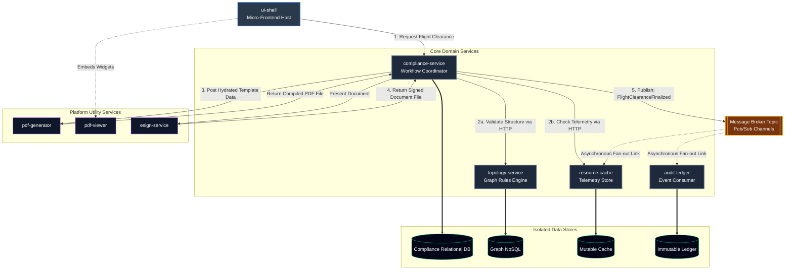

# Distributed Systems Architecture Portfolio

Aerospace distributed systems portfolio. Features a Kubernetes monorepo orchestrating 5 core microservices—UI Shell, Compliance coordinator, Graph topology, Resource cache, and an event-driven Immutable ledger—supported by 3 platform utility services for automated flight readiness document engineering.

## 1. System Vision & Architecture Map

### The Strategic Focus: Automated Launch & Flight Readiness Verification
In aerospace and defense software, mission assurance requires validating complex system constraints before executing operational commands. Human-in-the-loop verification introduces latency and safety risks. 

The primary mission of this platform is to demonstrate an automated, hands-free gateway architecture for **Aviation and UAV Fleet Operations**. The platform handles a core mission workflow: executing a cross-operation asset handover while automatically verifying relational structures and physical system telemetry over the network before generating cryptographically secure clearance documentation.



### Subsystem Architecture Breakdown
The monorepo separates mission-specific business domains from generic utility logic:

* **Core Services (The Domain Layer):**
  * `ui-shell`: Micro-frontend host container orchestrating the user portal interface.
  * `compliance-service`: The central process coordinator managing background network checks.
  * `topology-service`: Graph NoSQL-backed engine mapping asset dependencies and structural boundaries.
  * `resource-cache`: Volatile, fast-access memory store tracking real-time asset capacity and metrics.
  * `audit-ledger`: Append-only, event-driven database acting as the immutable "black box" flight log.
* **Platform Services (The Utility Layer):**
  * `pdf-generator`: Stateless utility wrapper converting structured verification payloads into PDF templates.
  * `pdf-viewer`: Client-facing web component rendering isolated document previews.
  * `esign-service`: Cryptographic signing utility to securely authorize generated clearance files.

### Architectural Standards
* **Isolation Pattern:** True Database-per-Service model ensuring zero cross-domain leakage over the cluster network.
* **Communication Protocols:** Synchronous REST HTTP (JSON) for blocking coordination checks; asynchronous message broker channels for resilient audit settlement.
* **Environment Strategy:** Microservices containerized via Docker and orchestrated natively via Kubernetes to ensure exact runtime parity across all development environments.

*Detailed architectural records and engineering rationales can be reviewed chronologically under `docs/adrs/`.*

---

## 2. 🛠️ Local Workspace Initialization (IaC Onboarding)

This repository utilizes an idempotent, self-healing **Infrastructure as Code (IaC)** environment gateway script to ensure 100% deterministic developer environment synchronization across different workstations. 

The script dynamically audits your host operating system (Linux/WSL, macOS), verifies/upgrades your Node.js engine range to **`>=v26.7.0`**, installs **`pnpm@11.22.0`** using native manager boundaries, verifies your Docker daemon status, injects low-level systems prerequisites (like `libatomic1` for Node 25+ Linux compatibility), and compiles your local workspace dependency tree.

### Prerequisites
Because the system infrastructure automates all runtime and package managers, the absolute only host-level prerequisite is a clean installation of Git:
* `git` (Core Source Control Engine)

### Automated System Standup
To clone the repository and completely configure your local machine's development environment in one shot, execute this single pipelined command string in your terminal:

```bash
git clone <repository-url> && cd distributed-systems-architecture-portfolio && chmod +x setup.sh && ./setup.sh
```

### Manual Operational Steps
If executing the pipeline step-by-step from an existing workspace or on machines requiring explicit permission overrides:

1. **Elevate Script Permissions:** Mark the bootstrap script as an executable binary within your OS kernel:
   ```bash
   chmod +x setup.sh
   ```
2. **Execute the Gateway:** Launch the self-healing installation loop:
   ```bash
   ./setup.sh
   ```
3. **Refresh Your Shell Profile:** Once the script successfully completes and appends the native pnpm path exports to your environment, reload your active terminal session:
   ```bash
   source ~/.bashrc
   ```

### Troubleshooting Benign Tool Warnings
When executing the initialization loop inside WSL or specific minimal Linux environments, the global `pnpm setup` engine may emit soft, non-blocking `ENOENT` directory warnings during multi-threaded symlink indexing. These are completely benign and safely bypassed by the script's internal fallback logic, which writes the primary export statements directly into your user's shell profile. No manual intervention is required.


## 3. Configuration Management & Quality Gate Workflow

To maintain strict configuration control, absolute traceability, and compliance with our **Strict-Main-Gate Ruleset**, direct pushes to the `master` branch are blocked by repository protection rules. Every change must pass through the integration workflow below.

### 1. Branch Naming Conventions
All adjustments must occur on sandboxed feature branches using the following prefix taxonomy:
*   `feat/`  - New microservice logic, endpoint contracts, or UI widgets (e.g., `feat/topology-graph-schema`).
*   `fix/`   - Patches, security remediations, or logical bug fixes.
*   `chore/` - Build tooling, Kubernetes manifests, or infrastructure adjustments.
*   `docs/`  - Systems engineering updates to the `/docs/` directory, ADRs, or ICDs.

### 2. The Development Lifecycle (Standard Operating Procedure)

Execute this path via your workspace terminal for all development tasks:

```bash
# Step A: Align local environment with the verified golden production state
git checkout master
git pull origin master

# Step B: Initialize an isolated branch for your specific task
git checkout -b <prefix>/<short-description>

# Step C: Stage and commit changes using Conventional Commit patterns
git add .
git commit -m "<type>(<scope>): <imperative_description>"

# Step D: Push the local branch up to the remote repository
git push --set-upstream origin <prefix>/<short-description>
```

### 3. Commit Message Standards (Conventional Commits)
Commit logs serve as the software history ledger for system audits. Messages must use structured prefixes to clearly define technical intent:
*   `feat(scope):` Adds a new capability (e.g., `feat(audit-ledger): implement event consumer for settlement`).
*   `fix(scope):` Corrects a system asset (e.g., `fix(pdf-generator): repair stream buffer leak during rendering`).
*   `chore(scope):` Alters configuration scripts (e.g., `chore(k8s): scaffold initial deployment ingress rules`).
*   `docs(scope):` Modifies engineering documentation or design records (e.g., `docs(adr): commit architecture design baseline for service mesh`).

### 4. Verification and Integration (The Code Gate)
Once a feature branch is pushed, the integration phase must execute via the GitHub web portal to satisfy configuration controls:

1. Navigate to the repository page on GitHub.
2. Click the green **Compare & pull request** button.
3. Title the Pull Request using conventional commit syntax, and populate the description with a bulleted list detailing **what changed** and **why it changed**.
4. Click **Create pull request** to submit the branch for integration.
5. Review the automated code diff to verify strict environment isolation and zero credential leakage.
6. Click **Merge pull request**, then **Confirm merge** to fold the verified code into the production baseline.

### 5. Workspace Cleanup
To prevent local workspace pollution and configuration drift following a successful merge, execute the following commands in your terminal:

```bash
# Step A: Return to your local master branch
git checkout master

# Step B: Fetch the freshly integrated production code from the remote server
git pull origin master

# Step C: Delete the local temporary branch now that its lifecycle is complete
git branch -d <prefix>/<short-description>
```
