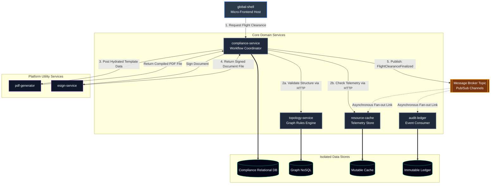

# Distributed Systems Architecture Portfolio

Aerospace distributed systems portfolio. Features a Kubernetes monorepo orchestrating 5 core microservices—UI Shell, Compliance coordinator, Graph topology, Resource cache, and an event-driven Immutable ledger—supported by 2 platform utility services for automated flight readiness document engineering.

## 1. System Vision & Architecture Map

### The Strategic Focus: Automated Launch & Flight Readiness Verification
In aerospace and defense software, mission assurance requires validating complex system constraints before executing operational commands. Human-in-the-loop verification introduces latency and safety risks. 

The primary mission of this platform is to demonstrate an automated, hands-free gateway architecture for **Aviation and UAV Fleet Operations**. The platform handles a core mission workflow: executing a cross-operation asset handover while automatically verifying relational structures and physical system telemetry over the network before generating cryptographically secure clearance documentation.




### Subsystem Architecture Breakdown
The monorepo separates presentation layout orchestration and mission-specific business domains from generic utility logic:

* **Presentation Layer (Orchestration Shells):**
  * `global-shell`: Top-level micro-frontend host container dynamically composing page-based layouts.
* **Core Services (The Domain Layer):**
  * `compliance-service`: The central process coordinator managing background network validation loops.
  * `topology-service`: Graph NoSQL-backed engine mapping asset dependencies and structural boundaries.
  * `resource-cache`: Volatile, fast-access memory store tracking real-time asset capacity and metrics.
  * `audit-ledger`: Append-only, event-driven database acting as the immutable "black box" flight log.
* **Platform Services (The Utility Layer):**
  * `pdf-generator`: Stateless utility wrapper converting structured verification payloads into PDF templates.
  * `esign-service`: Cryptographic signing utility to securely authorize generated clearance files.


### Architectural Standards
* **Isolation Pattern:** True Database-per-Service model ensuring zero cross-domain leakage over the cluster network.
* **Communication Protocols:** Synchronous REST HTTP (JSON) for blocking coordination checks; asynchronous message broker channels for resilient audit settlement.
* **Environment Strategy:** Microservices containerized via Docker and orchestrated natively via Kubernetes to ensure exact runtime parity across all development environments.

*Detailed architectural records and engineering rationales can be reviewed chronologically under `docs/adrs/`.*

---

## 2. Local Development

The integrated development workflow uses Docker, k3d, Kubernetes, Helm-managed Traefik, and Skaffold. Traefik is exposed through the k3d load balancer at `http://localhost:8081`; no manual `kubectl port-forward` is required.

### Fresh Environment

Install Git and Docker Desktop or Docker Engine first. On Linux or WSL, the current user must be able to run Docker commands. Docker must be running before `setup.sh` starts.

Clone the repository and enter the workspace:

```bash
git clone git@github.com:Brickwall72/distributed-systems-architecture-portfolio.git
cd distributed-systems-architecture-portfolio
```

Make the bootstrap executable and run it. Do not use pnpm before this step; the script installs pnpm when it is missing:

```bash
chmod +x setup.sh
BUILD_DOCKER_BASE=true ./setup.sh
```

`setup.sh` installs or verifies Node.js, pnpm, kubectl, Helm, k3d, and Skaffold; installs workspace dependencies; builds the workspace; builds `base-image:local`; creates or selects the `platform-cluster` k3d cluster; and installs or upgrades Traefik. The k3d cluster maps host ports `8081` and `8443` to the Traefik load balancer.

If the script updates your shell profile, reload it before using pnpm in a new shell:

```bash
source ~/.bashrc  # Linux/WSL
# or: source ~/.zshrc  # macOS
```

Create local environment files after pnpm is available:

```bash
pnpm env:copy
```

### Start the Local Platform

Run these steps in order from a freshly bootstrapped workspace. `setup.sh`
already creates the cluster and installs Traefik; the explicit commands below
are idempotent checks that also recover a stopped local cluster.

Select or create the k3d cluster:

```bash
pnpm k3d:up
```

Ensure Traefik is installed:

```bash
pnpm helm
```

Create the Kubernetes database credentials while the cluster API is available:

```bash
(export $(grep "^DB_PASSWORD=" services/core/topology-service/.env) && pnpm k8s:secrets)
```

If `DB_PASSWORD` is omitted, the helper generates a local value. The command is
idempotent when the Secret already exists, so restarting Skaffold does not
silently rotate credentials used by running pods.

Start the integrated development deployment and leave it running:

```bash
pnpm skaffold
```

### Integrated Kubernetes Development

After the ordered startup steps above, open the application at
[http://localhost:8081](http://localhost:8081). Useful checks are:

For a complete rebuild without cached artifacts, stop the current Skaffold
process first, then run:

```bash
pnpm skaffold:reset
```

```bash
kubectl config current-context
kubectl get pods,svc,ingress -A
curl -i http://localhost:8081/
curl -i http://localhost:8081/topology/client/remoteEntry.js
curl -i http://localhost:8081/compliance/client/remoteEntry.js
curl -i http://localhost:8081/pdf/client/remoteEntry.js
curl -i http://localhost:8081/api/v1/topology/health
curl -i http://localhost:8081/api/v1/pdf/health
```

The expected Kubernetes context is `k3d-platform-cluster`. The frontend federation and API configuration intentionally uses `localhost:8081`, while the internal client ports remain topology `3011`, compliance `3021`, and PDF `4011`.

### Service-Level Compose Development

Use Compose when working on individual containers without the Kubernetes stack. The root Compose file includes the service-owned definitions and does not bind port `8081`:

```bash
docker compose up --build
```

The direct development ports are:

| Component | Port |
| --- | ---: |
| Global shell | `3000` |
| Topology shell | `3010` |
| Topology client | `3011` |
| Compliance shell | `3020` |
| Compliance client | `3021` |
| Topology API | `8083` |
| PDF client | `4011` |
| PDF API | `4001` |
| Neo4j browser | `7474` |
| Neo4j Bolt | `7687` |

Stop Compose with `Ctrl+C`, or remove its containers with:

```bash
docker compose down
```

Do not run the Compose and Skaffold workflows on the same service ports at the same time.

To preserve Compose Neo4j graph data intentionally, start the topology project
with its persistence override. Use the same project name and files when stopping
it:

```bash
docker compose -p topology-service \
	-f services/core/topology-service/compose.yaml \
	-f services/core/topology-service/compose.persist.yaml up --build
```

```bash
docker compose -p topology-service \
	-f services/core/topology-service/compose.yaml \
	-f services/core/topology-service/compose.persist.yaml down
```

### Cleanup and Storage

Tear down the integrated Kubernetes workflow in this order:

1. Stop the running Skaffold process with `Ctrl+C`. Skaffold removes its
	managed workloads while leaving the local namespace and generated Secret
	available for the next run.
2. Delete the local k3d cluster and its containers:

```bash
pnpm k3d:down
```

The cluster deletion also removes the `platform-local` namespace and its
Kubernetes Secret. Do not run `pnpm k8s:secrets` after this step unless you have
started the cluster again with `pnpm k3d:up`.

If you used the ordinary root Compose workflow separately, stop it before
cleaning Docker resources:

```bash
docker compose down
```

Only after the workloads and cluster are stopped should you inspect or clean
Docker storage:

```bash
pnpm docker:df
```

Kubernetes and default Compose Neo4j deployments are ephemeral. If you used the
persistent topology Compose workflow, stop that exact project before resetting
its graph data. The following intentionally removes the Neo4j volume and all
data stored in it:

```bash
docker compose -p topology-service \
  -f services/core/topology-service/compose.yaml \
  -f services/core/topology-service/compose.persist.yaml down -v
```

Use `pnpm docker:df` for a detailed Docker storage report. `pnpm docker:prune`
removes dangling images and unused builder cache without pruning volumes or all
images. Use broader Docker cleanup commands only when you intend to rebuild
unrelated projects as well.

The PDF server image includes Chromium and is intentionally large. Prefer targeted cleanup first:

```bash
docker image prune -f
docker builder prune -f
```

Use `docker builder prune -a` only when you are comfortable rebuilding all cached layers. Avoid routine `docker volume prune` because it can remove data used by unrelated projects.

### Troubleshooting

**Docker daemon unavailable:** Run `docker info`. Start Docker Desktop or the Docker Engine and rerun `./setup.sh`.

**Port `8081` is already in use:** Find the owning process with `ss -ltnp | grep ':8081'` on Linux/WSL. Stop the conflicting process or container before running `pnpm k3d:up`.

**Wrong Kubernetes context:** Run `pnpm k3d:up`; it creates the named cluster when absent and selects `k3d-platform-cluster`.

**Traefik returns `404`:** A `404` from `localhost:8081` before Skaffold deploys application Ingress resources confirms that Traefik is reachable. Start `pnpm skaffold` and inspect `kubectl get ingress -A`.

**Skaffold appears stuck loading images:** The PDF server image contains Chromium and can take a while to import into k3d. Check `docker ps`, wait for the import to finish, and avoid interrupting it unless the process is genuinely stalled.

**Skaffold cannot find `base-image:local`:** Run `pnpm docker:base`; `pnpm skaffold`
and `pnpm skaffold:reset` perform this base build automatically.

The Docker and Skaffold scripts verify Docker BuildKit/buildx before building.

**Benign pnpm `ENOENT` warnings:** `pnpm setup` can emit symlink warnings in WSL or minimal Linux environments. Confirm that `pnpm --version` works in a new shell; rerun setup only if pnpm is unavailable.


## 3. Configuration Management & Quality Gate Workflow

To maintain strict configuration control, absolute traceability, and compliance with our **Strict-Main-Gate Ruleset**, direct pushes to the `master` branch are blocked by repository protection rules. Every change must pass through the integration workflow below.

### 1. Branch Naming Conventions
All adjustments must occur on sandboxed feature branches using the following prefix taxonomy:
*   `feat/`  - New microservice logic, endpoint contracts, or UI widgets (e.g., `feat/topology-graph-schema`).
*   `fix/`   - Patches, security remediations, or logical bug fixes.
*   `chore/` - Build tooling, Kubernetes manifests, or infrastructure adjustments.
*   `docs/`  - Systems engineering updates to the `/docs/` directory, ADRs, or ICDs.

### 2. The Development Lifecycle (Standard Operating Procedure)

Execute this path via your workspace terminal for all development tasks:

```bash
# Step A: Align local environment with the verified golden production state
git checkout master
git pull origin master

# Step B: Initialize an isolated branch for your specific task
git checkout -b <prefix>/<short-description>

# Step C: Stage and commit changes using Conventional Commit patterns
git add .
git commit -m "<type>(<scope>): <imperative_description>"

# Step D: Push the local branch up to the remote repository
git push --set-upstream origin <prefix>/<short-description>
```

### 3. Commit Message Standards (Conventional Commits)
Commit logs serve as the software history ledger for system audits. Messages must use structured prefixes to clearly define technical intent:
*   `feat(scope):` Adds a new capability (e.g., `feat(audit-ledger): implement event consumer for settlement`).
*   `fix(scope):` Corrects a system asset (e.g., `fix(pdf-generator): repair stream buffer leak during rendering`).
*   `chore(scope):` Alters configuration scripts (e.g., `chore(k8s): scaffold initial deployment ingress rules`).
*   `docs(scope):` Modifies engineering documentation or design records (e.g., `docs(adr): commit architecture design baseline for service mesh`).

### 4. Verification and Integration (The Code Gate)
Once a feature branch is pushed, the integration phase must execute via the GitHub web portal to satisfy configuration controls:

1. Navigate to the repository page on GitHub.
2. Click the green **Compare & pull request** button.
3. Title the Pull Request using conventional commit syntax, and populate the description with a bulleted list detailing **what changed** and **why it changed**.
4. Click **Create pull request** to submit the branch for integration.
5. Review the automated code diff to verify strict environment isolation and zero credential leakage.
6. Click **Merge pull request**, then **Confirm merge** to fold the verified code into the production baseline.

### 5. Workspace Cleanup
To prevent local workspace pollution and configuration drift following a successful merge, execute the following commands in your terminal:

```bash
# Step A: Return to your local master branch
git checkout master

# Step B: Fetch the freshly integrated production code from the remote server
git pull origin master

# Step C: Delete the local temporary branch now that its lifecycle is complete
git branch -d <prefix>/<short-description>
```
