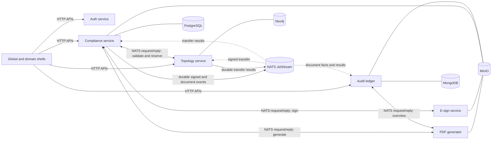

<!-- File: README.md -->
# Distributed Systems Architecture Portfolio

An aerospace-themed portfolio demonstrating custody transfers across a
microservice system. Organizations use federated UI workflows to prepare and
sign transfer authorizations and receipts; services validate custody, reconcile
events, and preserve an audit record. This is a local demonstration, not a
production flight-readiness or telemetry system.

## 1. System and architecture


```mermaid
flowchart LR
  UI[Global and domain shells] -->|HTTP APIs| AUTH[Auth service]
  UI -->|HTTP APIs| COMP[Compliance service]
  UI -->|HTTP APIs| TOPO[Topology service]
  UI -->|HTTP APIs| AUDIT[Audit ledger]
  COMP <-->|NATS request/reply: validate and reserve| TOPO
  COMP <-->|NATS request/reply: generate| PDF[PDF generator]
  COMP <-->|NATS request/reply: sign| ESIGN[E-sign service]
  AUDIT <-->|NATS request/reply: overview| PDF
  COMP -->|durable signed and document events| NATS[(NATS JetStream)]
  NATS -.->|signed transfer| TOPO
  TOPO -->|durable transfer results| NATS
  NATS -.->|transfer results| COMP
  NATS -.->|document facts and results| AUDIT
  COMP --- PG[(PostgreSQL)]
  TOPO --- NEO[(Neo4j)]
  AUDIT --- MONGO[(MongoDB)]
  PDF --- S3[(MinIO)]
  ESIGN --- S3
  COMP --- S3
  AUDIT --- S3
```

The arrows between services labeled request/reply are blocking NATS requests,
not direct HTTP links. Event delivery is asynchronous and retried using durable
outboxes. The [generated service composition and interaction view](./docs/generated/architecture/architecture.md)
shows the federated widgets and communication types.

### Services and workflow

- **Global and domain shells** compose the auth, topology, compliance, and audit
  micro-frontends. Users select a demo profile and work with the scoped data.
- **Auth** issues identities and roles. The profile picker is impersonable and
  intended for fictional local data, not production authentication.
- **Topology** owns the Neo4j custody graph. It validates draft facts and
  reserves assets synchronously over NATS. It consumes signed events, applies
  physical or C2 transitions, and publishes committed results.
- **Compliance** coordinates draft generation and signing, records documents
  and participant access in PostgreSQL, and durably publishes signed events.
  Signing returns without waiting for topology's eventual application; the UI
  shows pending, applied, or attention-required synchronization.
- **Audit ledger** consumes document facts and topology snapshots, seals
  completed transfer records only when required receipts are present, and
  requests PDF overviews. Its MongoDB-backed records are participant-scoped.
- **PDF generator and e-sign** render and cryptographically sign documents;
  MinIO stores artifacts and serves time-limited signed downloads.

Current custodians and intended receivers of in-transit assets may view the
asset's full visual transfer history. Transfer participants can access their
own documents, while platform auditors have global read-only access.
Reservations cover authorizations and receipts to prevent overlapping
signatures. See the [ADRs](./docs/adr/) for design decisions.

### Generated Architecture and Software Inventory

CI builds every application image declared in `skaffold.yaml`, then generates a CycloneDX JSON SBOM and a visual HTML report for each image. The [generated SBOM index](./docs/generated/sbom/index.md) links to each report. The structured [architecture model](./docs/architecture/model.json) separately records page/widget composition and communication patterns; it is rendered as both Markdown (Mermaid) and HTML.

On pull requests and pushes, the reports are attached to the GitHub Actions run as the `sbom-and-architecture-reports` artifact. On pushes to `master`, after the verification and report-generation jobs pass, CI opens or updates a pull request with changed outputs under `docs/generated/`, then explicitly runs verification against that report branch. It avoids replacing a committed image report when the image digest and report-tool versions are unchanged. This requires GitHub Actions to have Actions, repository contents, and pull-request write permissions; the report updates still go through the normal `master` review and branch-protection process.

Trivy runs with its license scanner for inventory metadata, not its vulnerability scanner. Sunshine displays a vulnerability summary, but a zero count here means vulnerability data was not included; it does not mean a vulnerability scan passed.

Adding a deployable image to `skaffold.yaml` is enough for it to be included in SBOM generation. Update `docs/architecture/model.json` only when the image participates in a UI composition or service interaction that should appear in the architecture view. For local generation, prepare the pinned [CycloneDX Sunshine revision](https://github.com/CycloneDX/Sunshine/tree/beaab3faf2bab234069a8677fc627de2f0f01a3d):

```bash
mkdir -p .tools
git clone https://github.com/CycloneDX/Sunshine.git .tools/cyclonedx-sunshine
git -C .tools/cyclonedx-sunshine checkout beaab3faf2bab234069a8677fc627de2f0f01a3d
python3 -m pip install requests==2.32.5
pnpm docs:generate
```

The command also requires Docker with Buildx, Skaffold, Trivy, and Python 3; `SUNSHINE_CLI` can point to a different `sunshine.py` path.

---

## 2. Local Development

The integrated development workflow uses Docker, k3d, Kubernetes, Helm (Traefik, `traefik-shared`, and every service/shell chart under `charts/`), and Skaffold. Traefik is exposed through the k3d load balancer at `http://localhost:8081`; no manual `kubectl port-forward` is required.

### Fresh Environment

Install Git and Docker Desktop or Docker Engine first. On Linux or WSL, the current user must be able to run Docker commands. Docker must be running before `setup.sh` starts.

Clone the repository and enter the workspace:

```bash
git clone git@github.com:Brickwall72/distributed-systems-architecture-portfolio.git
cd distributed-systems-architecture-portfolio
```

Make the bootstrap executable and run it. Do not use pnpm before this step; the script installs pnpm when it is missing:

```bash
chmod +x setup.sh
BUILD_DOCKER_BASE=true ./setup.sh
```

`setup.sh` installs or verifies Node.js, pnpm, kubectl, Helm, k3d, and Skaffold; installs workspace dependencies; builds the workspace; builds `base-image:local`; creates or selects the `platform-cluster` k3d cluster; and installs or upgrades Traefik. The k3d cluster maps host ports `8081` and `8443` to the Traefik load balancer.

If the script updates your shell profile, reload it before using pnpm in a new shell:

```bash
source ~/.bashrc  # Linux/WSL
# or: source ~/.zshrc  # macOS
```

Create local environment files after pnpm is available. This copies every
`.env.example` over its corresponding `.env`; do not run it if you need to
preserve existing local configuration without first backing it up:

```bash
pnpm env:copy
```

### Start the Local Platform

Run these steps in order from a freshly bootstrapped workspace. `setup.sh`
already creates the cluster and installs Traefik; the explicit commands below
are idempotent checks that also recover a stopped local cluster.

Select or create the k3d cluster:

```bash
pnpm k3d:up
```

Ensure Traefik and the shared Traefik middlewares are installed:

```bash
pnpm helm
```

Vendor `platform-lib` into every service/shell chart's `charts/` directory. Run this once after clone and again whenever `charts/platform-lib` or any chart's `Chart.yaml` dependencies change:

```bash
pnpm charts:deps
```

Create the Kubernetes database credentials while the cluster API is available:

```bash
pnpm k8s:secrets
```

If `DB_PASSWORD` is omitted, the helper generates a local value. The command is
idempotent when the Secret already exists, so restarting Skaffold does not
silently rotate credentials used by running pods.

Start the integrated development deployment and leave it running:

```bash
pnpm skaffold
```

### Integrated Kubernetes Development

After the ordered startup steps above, open the application at
[http://localhost:8081](http://localhost:8081). Useful checks are:

For a complete rebuild without cached artifacts, stop the current Skaffold
process first, then run:

```bash
pnpm skaffold:reset
```

```bash
kubectl config current-context
kubectl get pods,svc,ingress -A
curl -i http://localhost:8081/
curl -i http://localhost:8081/topology/client/remoteEntry.js
curl -i http://localhost:8081/compliance/client/remoteEntry.js
curl -i http://localhost:8081/topology/api/v1/health
curl -i http://localhost:8081/pdf/api/v1/health
```

The expected Kubernetes context is `k3d-platform-cluster`. The browser reaches
the application and APIs through Traefik on `localhost:8081`. The charts use
port `3000` for client/shell containers and `8080` for server containers;
these are internal ports, not separately published host ports.

PDF presigned URLs use `http://minio.localhost:8081`, routed to the MinIO S3 API Service on port `9000` (not the web console on port `9001`). The MinIO API allows browser CORS for this local workflow; a successful presigned download should return `Content-Type: application/pdf`.

The compliance document viewer also signs download URLs. The compliance server uses
`S3_PUBLIC_ENDPOINT`, `S3_REGION`, `S3_ACCESS_KEY`, and `S3_SECRET_KEY`: Compose
reads them from the compliance service environment, while the Helm chart reads
credentials from `minio-credentials`. Set the public endpoint to the exact
browser-reachable S3 origin before deployment; `minio.localhost` works only on
the local machine. Remote deployments need an HTTPS endpoint, compatible S3
ingress and CORS permitting the frontend origin; rewriting a URL after signing
invalidates its signature. Configure the same browser-reachable
`S3_PUBLIC_ENDPOINT` for the PDF and e-sign services, which also issue URLs.

Compliance drafts use topology-owned organization and asset facts, and signing
uses topology-owned reservations and atomic custody transitions. Draft
validation and authorization/receipt reservations use synchronous NATS
request/reply. After e-signing, compliance saves the document and durable event
intents before returning the PDF; topology applies the reserved transition
asynchronously. The workflow and document table show pending, applied, or
attention-required synchronization. A pending update needs attention after five
minutes or when publication fails; the status clears when recovery completes.
Signing is durable and may continue after a timeout; retry the identical request
rather than creating a replacement signature. An unresolved signing operation retains
its signature image in the compliance database until completion or a pre-signing
conflict. Restrict database access, encrypt backups, and monitor retry failures;
never discard an uncertain operation or release its signing claim without first
reconciling the signed artifact and topology state. Fresh topology seeds use UUID
transfer identifiers; existing development graphs must be reinitialized to use them.
The demo graph is seeded only when no topology entities exist, so restarting
the service does not recreate custody relationships after a transfer.
The e-sign service requires a readable P12 certificate and a matching
`SIGNING_CERT_PASSWORD`; signing fails rather than returning an unsealed PDF
when the certificate or cryptographic seal cannot be applied. The legacy
`CERT_PASSPHRASE` variable is accepted if `SIGNING_CERT_PASSWORD` is unset.
Demo login also allows callers to select any seeded identity. Compose and Helm
configure the `dsap` bucket without anonymous access, but a presigned URL can
be used by anyone holding it until it expires. Use fictional data only; this
development configuration does not protect sensitive documents. NATS uses
per-service identities, subject permissions, and private reply inboxes.
Topology and compliance create or verify their own event streams; subscribers
create or verify their own durable consumers. Permissions authorize those
specific JetStream operations rather than granting unrestricted administration.
The local broker connections are plaintext and the local credentials are not a
production secret-management solution. Use TLS, network isolation and managed
secret rotation for a real deployment.

### Service-Level Compose Development

Use Compose when working on individual containers without the Kubernetes stack. The root Compose file includes the service-owned definitions and does not bind port `8081`:

```bash
pnpm docker:base
docker compose up --build -d
```

`pnpm docker:base` generates persistent local NATS credentials under the
ignored `.auth-keys/nats/` directory, retaining existing passwords on subsequent
runs. Compose starts an authenticated broker, then services initialize their own
streams and consumers. Existing JetStream data and consumer acknowledgements are
preserved; incompatible subject or consumer configuration fails rather than being
silently replaced. Do not commit these credentials.
Any old topology key in the root `.env` is left untouched but is no longer used.
Rebuild the shared base image after changing workspace packages; service image
builds otherwise use the existing `base-image:local` snapshot.
For local Kubernetes, `pnpm k8s:secrets` creates matching broker and per-service
Secrets if absent. It refuses to overwrite an existing Secret that differs from
the local credentials. Older broker Secrets may retain an unused admin key; it
is ignored and need not be deleted. Coordinate credential rotation across the
broker and services, and use a secure secret manager outside local development.

Publishers initialize their streams before publishing; subscribers wait for
upstream streams and remain unready until their durable consumers are available.
Retained stream events are available to a newly created consumer, subject to
JetStream retention limits. Events published before a stream exists cannot be
retained by that stream; the transfer outboxes retry publication on failure.
NATS permissions are subject-based: authorizing a service to create its own
stream or consumer is not a general validation of every field in its request.
Contracts and service validation remain necessary.

#### Signing and synchronization recovery

The database twin shows signed documents even while topology is unavailable.
The topology and compliance outboxes retry publication; topology also retries
rejected signed events. Check service logs and the following read-only local
queries when synchronization needs attention:

```bash
docker compose exec compliance-db sh -c \
  'psql -U "$POSTGRES_USER" -d compliance -c "SELECT document_id, state, last_error_code, updated_at FROM compliance_signing_operations WHERE state <> '\''COMPLETED'\'' ORDER BY updated_at;"'
docker compose exec compliance-db sh -c \
  'psql -U "$POSTGRES_USER" -d compliance -c "SELECT document_id, subject, last_error, next_attempt_at FROM compliance_signed_outbox WHERE published_at IS NULL ORDER BY created_at;"'
```

In the Neo4j browser, `MATCH (c:TransferClaim {state: 'SIGNING'}) RETURN
c.documentId, c.transferEventId, c.createdAt` lists reservations still held
for signing. Restore the failed dependency and let the existing workers retry;
inspect both databases and the signed object when intervention is needed.
These reservations do not expire and there is no automatic release for an
uncertain signature. Do not delete an operation, acknowledge a rejected event,
or release a claim merely because a request timed out: doing so can create
conflicting signed documents or incomplete audit records.

The root Compose deployment exposes the application through Traefik at
`http://localhost/` (port `80`). Client/shell and server containers use
internal ports `3000` and `8080`; access their routes through Traefik rather
than assuming distinct host ports for each application. Other default
published host ports are:

| Component | Host port | Notes |
| --- | --- | --- |
| Traefik dashboard | `8090` | Local development dashboard |
| NATS / monitoring | `4222` / `8222` | Broker and health/monitoring |
| MinIO API / console | `9000` / `9001` | S3 and web console |
| Neo4j browser / Bolt | `7474` / `7687` | Browser port is configurable |
| PostgreSQL / MongoDB | `5432` / `27017` | Database ports are configurable |
| DbGate | `3040` | Database administration UI |

These are defaults from the Compose configuration; service `.env` files may
change database mappings. Inspect the resolved ports with
`docker compose config`. The Kubernetes setup instead exposes Traefik at
`localhost:8081` and does not imply the same host-port mappings.

Stop and remove the Compose containers with:

```bash
docker compose down
```

### Integration tests

Run `pnpm test:integration` separately from `pnpm test`. It requires Docker
with Compose, pnpm, OpenSSL and curl. The command starts disposable PostgreSQL,
Neo4j, NATS JetStream (including an authenticated broker) and MinIO containers on dynamically allocated loopback
ports after building required workspace dependencies, runs the integration tests,
and removes only its own project resources.
It uses a separate empty Neo4j instance for the seed test. Existing development
databases and containers are not used.

The cross-service boundary test uses real PostgreSQL, Neo4j, NATS and the audit
consumer but simulates PDF generation and e-sign responses. The e-sign
integration test independently verifies a real PDF signature with a temporary
certificate and OpenSSL. Run individual tests with explicitly configured,
isolated test services only; never point them at development or production data.

Do not run the Compose and Skaffold workflows on the same service ports at the same time.

### Cleanup and Storage

Tear down the integrated Kubernetes workflow in this order:

1. Stop the running Skaffold process with `Ctrl+C`. Skaffold removes its
	managed Helm releases while leaving the local namespace and generated Secret
	available for the next run.
2. Remove the Traefik and `traefik-shared` Helm releases:

```bash
pnpm helm:down
```

3. Delete the local k3d cluster and its containers:

```bash
pnpm k3d:down
```

The cluster deletion also removes the `platform-local` namespace and its
Kubernetes Secret. Do not run `pnpm k8s:secrets` after this step unless you have
started the cluster again with `pnpm k3d:up`. Running `pnpm k3d:down` alone is
sufficient to remove Traefik too, since it deletes the whole cluster; use
`pnpm helm:down` on its own only when you want to reset Traefik/`traefik-shared`
without tearing down the entire cluster.

If you used the ordinary root Compose workflow separately, stop it before
cleaning Docker resources:

```bash
docker compose down
```

Only after the workloads and cluster are stopped should you inspect or clean
Docker storage:

```bash
pnpm docker:df
```

The root Compose deployment uses named volumes for Neo4j, PostgreSQL, MongoDB,
MinIO, and NATS. `docker compose down` preserves them; `docker compose down -v`
deletes that Compose project's volumes and their data. Inspect the project and
its volumes before choosing the latter. `pnpm k3d:down` removes the
`platform-cluster` and Docker volumes mounted by its named k3d nodes, including
anonymous k3d volumes; it does not remove volumes from other projects.

Use `pnpm docker:df` for a detailed Docker storage report. `pnpm docker:prune`
removes unused BuildKit cache and dangling images without pruning volumes. Run it
after `pnpm k3d:down` when a rebuild leaves cache you no longer need. `pnpm
skaffold:reset` intentionally disables Skaffold artifact caching and can create
large temporary image layers; prefer `pnpm skaffold` for normal development.

The project cannot safely delete anonymous Docker volumes that are not mounted
by a `platform-cluster` node: Docker does not retain ownership labels for them.
Inspect such volumes with `docker volume ls` and remove only volumes whose owner
you can identify. Avoid routine `docker volume prune`, because it may remove
data used by unrelated projects.

The PDF server image includes Chromium and is intentionally large. Prefer targeted cleanup first:

```bash
docker image prune -f
docker builder prune -f
```

Use `docker buildx prune -a` only when you are comfortable rebuilding all cached layers.

### Troubleshooting

**Docker daemon unavailable:** Run `docker info`. Start Docker Desktop or the Docker Engine and rerun `./setup.sh`.

**Port `8081` is already in use:** Find the owning process with `ss -ltnp | grep ':8081'` on Linux/WSL. Stop the conflicting process or container before running `pnpm k3d:up`.

**Wrong Kubernetes context:** Run `pnpm k3d:up`; it creates the named cluster when absent and selects `k3d-platform-cluster`.

**Traefik returns `404`:** A `404` from `localhost:8081` before Skaffold deploys application Ingress resources confirms that Traefik is reachable. Start `pnpm skaffold` and inspect `kubectl get ingress -A`.

**Skaffold appears stuck loading images:** The PDF server image contains Chromium and can take a while to import into k3d. Check `docker ps`, wait for the import to finish, and avoid interrupting it unless the process is genuinely stalled.

**Skaffold cannot find `base-image:local`:** Run `pnpm docker:base`; `pnpm skaffold`
and `pnpm skaffold:reset` perform this base build automatically.

The Docker and Skaffold scripts verify Docker BuildKit/buildx before building.

**Benign pnpm `ENOENT` warnings:** `pnpm setup` can emit symlink warnings in WSL or minimal Linux environments. Confirm that `pnpm --version` works in a new shell; rerun setup only if pnpm is unavailable.


## 3. Configuration Management & Quality Gate Workflow

To maintain strict configuration control, absolute traceability, and compliance with our **Strict-Main-Gate Ruleset**, direct pushes to the `master` branch are blocked by repository protection rules. Every change must pass through the integration workflow below.

### 1. Branch Naming Conventions
All adjustments must occur on sandboxed feature branches using the following prefix taxonomy:
*   `feat/`  - New microservice logic, endpoint contracts, or UI widgets (e.g., `feat/topology-graph-schema`).
*   `fix/`   - Patches, security remediations, or logical bug fixes.
*   `chore/` - Build tooling, Kubernetes manifests, or infrastructure adjustments.
*   `docs/`  - Systems engineering updates to the `/docs/` directory, ADRs, or ICDs.

### 2. The Development Lifecycle (Standard Operating Procedure)

Execute this path via your workspace terminal for all development tasks:

```bash
# Step A: Align local environment with the verified golden production state
git checkout master
git pull origin master

# Step B: Initialize an isolated branch for your specific task
git checkout -b <prefix>/<short-description>

# Step C: Stage and commit changes using Conventional Commit patterns
git add .
git commit -m "<type>(<scope>): <imperative_description>"

# Step D: Push the local branch up to the remote repository
git push --set-upstream origin <prefix>/<short-description>
```

### 3. Commit Message Standards (Conventional Commits)
Commit logs serve as the software history ledger for system audits. Messages must use structured prefixes to clearly define technical intent:
*   `feat(scope):` Adds a new capability (e.g., `feat(audit-ledger): implement event consumer for settlement`).
*   `fix(scope):` Corrects a system asset (e.g., `fix(pdf-generator): repair stream buffer leak during rendering`).
*   `chore(scope):` Alters configuration scripts (e.g., `chore(k8s): scaffold initial deployment ingress rules`).
*   `docs(scope):` Modifies engineering documentation or design records (e.g., `docs(adr): commit architecture design baseline for service mesh`).

### 4. Verification and Integration (The Code Gate)
Once a feature branch is pushed, the integration phase must execute via the GitHub web portal to satisfy configuration controls:

1. Navigate to the repository page on GitHub.
2. Click the green **Compare & pull request** button.
3. Title the Pull Request using conventional commit syntax, and populate the description with a bulleted list detailing **what changed** and **why it changed**.
4. Click **Create pull request** to submit the branch for integration.
5. Review the automated code diff to verify strict environment isolation and zero credential leakage.
6. Click **Merge pull request**, then **Confirm merge** to fold the verified code into the production baseline.

### 5. Workspace Cleanup
To prevent local workspace pollution and configuration drift following a successful merge, execute the following commands in your terminal:

```bash
# Step A: Return to your local master branch
git checkout master

# Step B: Fetch the freshly integrated production code from the remote server
git pull origin master

# Step C: Delete the local temporary branch now that its lifecycle is complete
git branch -d <prefix>/<short-description>
```
